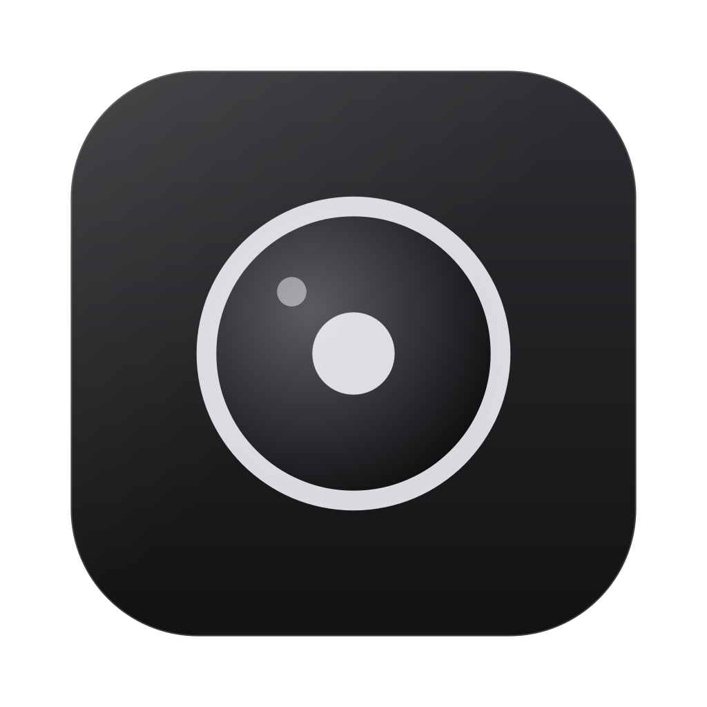
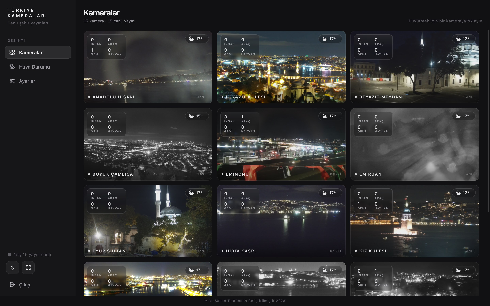
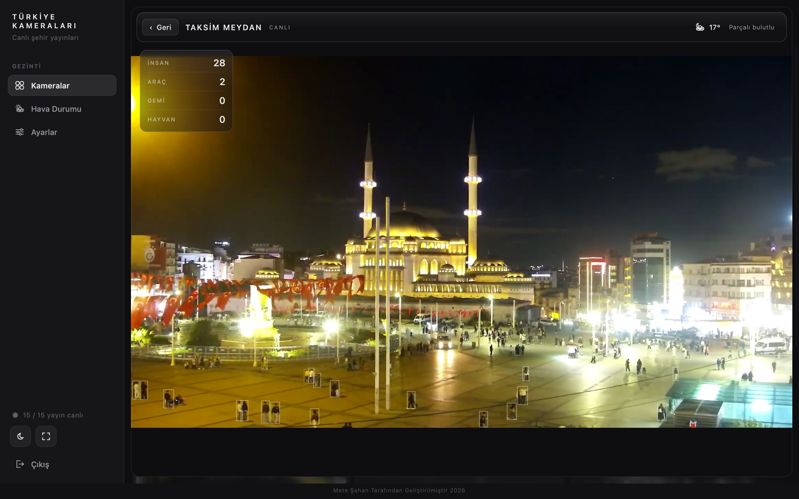
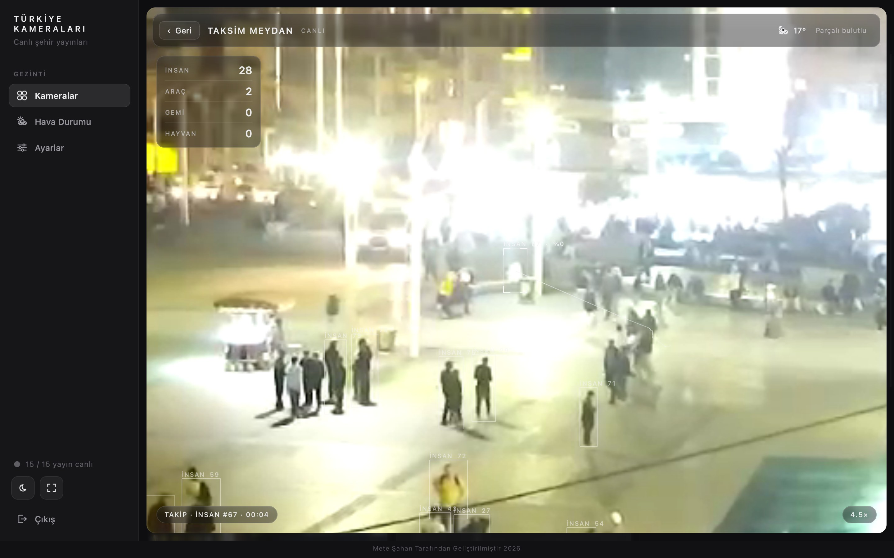
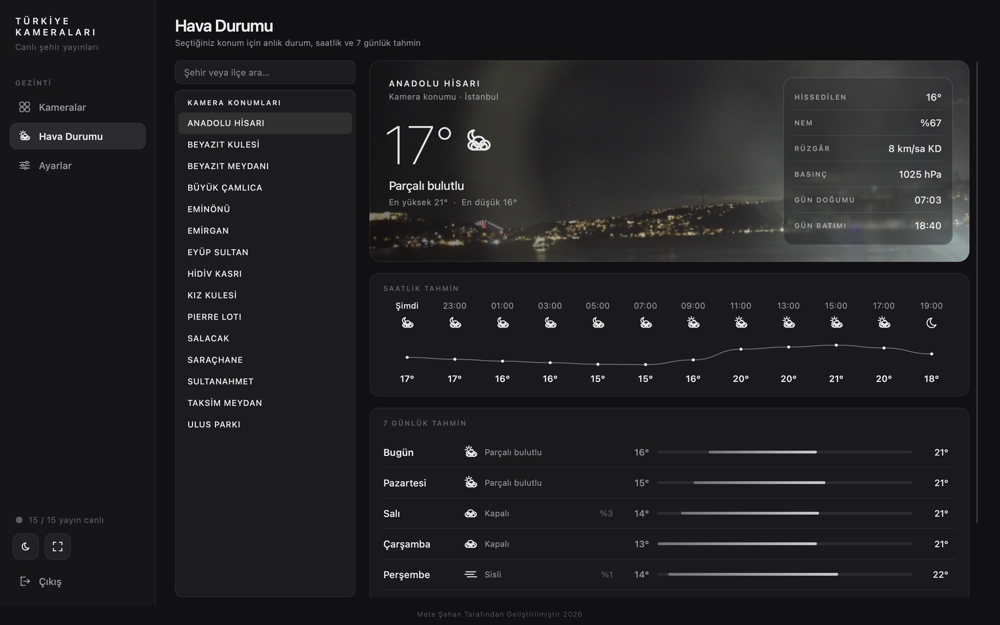
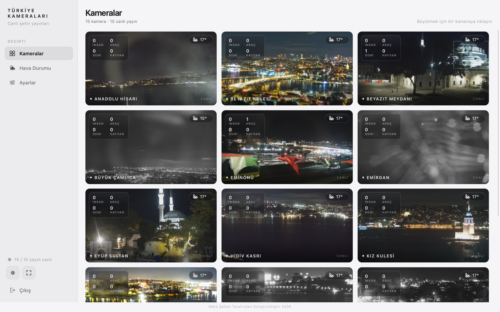
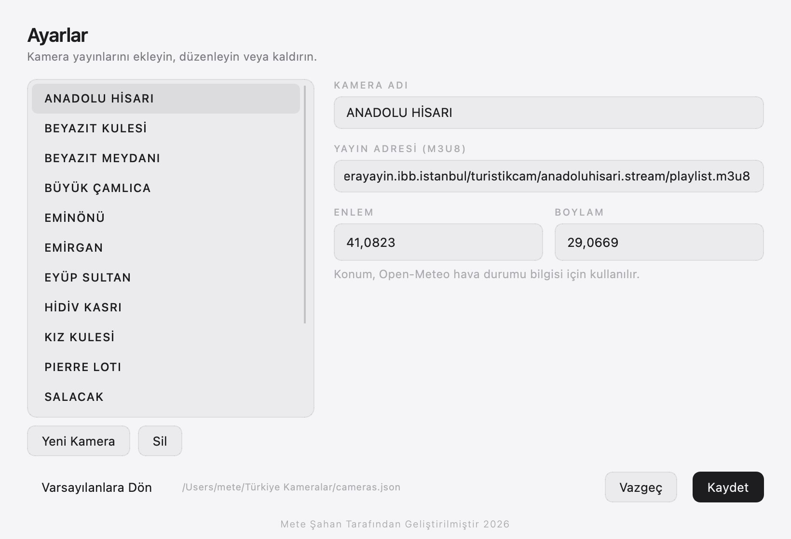
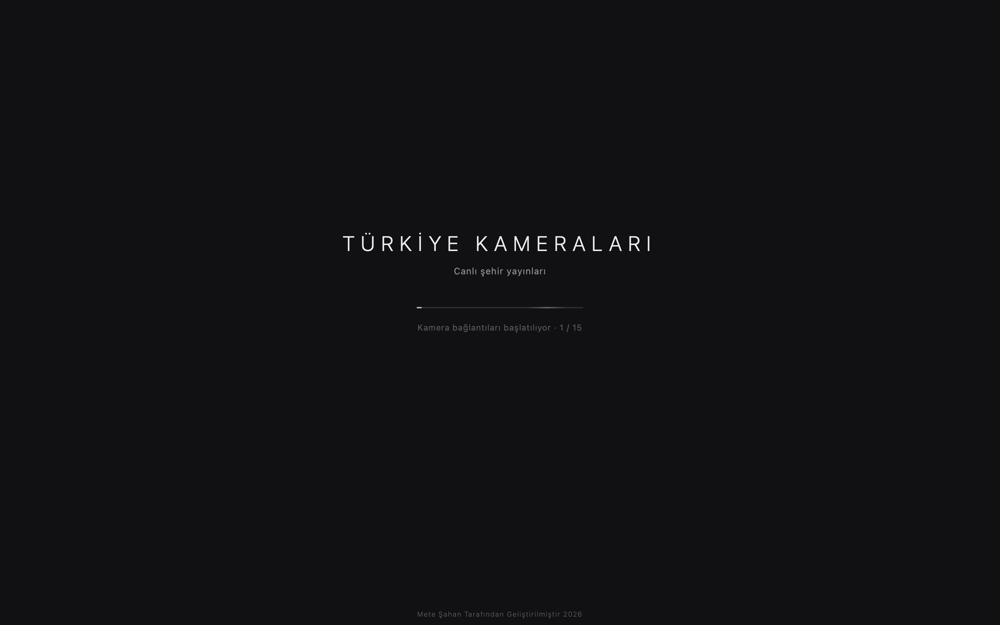

<p align="center">
  
</p>

<h1 align="center">Türkiye Kameraları</h1>

<p align="center">
  İstanbul'un canlı şehir kameralarını tek ekranda izleyen, yapay zekâ ile insan, araç, gemi ve sokak hayvanlarını
  tespit edip takip eden masaüstü uygulaması.
  <br>macOS ve Windows'ta kendi penceresinde çalışır. Karanlık ve aydınlık tema desteklenir.
</p>

<p align="center">
  <a href="https://github.com/metesahan/Turkiye-Kameralar/releases/latest/download/Turkiye-Kameralari-macOS.zip"><b>⬇ macOS için indir</b></a>
  &nbsp;&nbsp;·&nbsp;&nbsp;
  <a href="https://github.com/metesahan/Turkiye-Kameralar/releases/latest/download/Turkiye-Kameralari-Windows.zip"><b>⬇ Windows için indir</b></a>
  &nbsp;&nbsp;·&nbsp;&nbsp;
  <a href="https://github.com/metesahan/Turkiye-Kameralar/releases/latest">Tüm sürümler</a>
</p>



---

## İçindekiler

- [İndirme ve kurulum](#i̇ndirme-ve-kurulum)
- [Ekran görüntüleri](#ekran-görüntüleri)
- [Özellikler](#özellikler)
- [Yapay zekâ altyapısı](#yapay-zekâ-altyapısı)
- [Kaynak koddan çalıştırma](#kaynak-koddan-çalıştırma)
- [Proje yapısı](#proje-yapısı)
- [Yeni sürüm yayınlama](#yeni-sürüm-yayınlama)

---

## İndirme ve kurulum

Yukarıdaki bağlantılara tıklayınca dosya doğrudan iner. Python ya da başka bir kurulum gerekmez; yapay zekâ modelleri uygulamanın içindedir.

| Sistem | Dosya | Ne yapmalı |
|---|---|---|
| macOS (Apple Silicon: M1/M2/M3/M4) | [`Turkiye-Kameralari-macOS.zip`](https://github.com/metesahan/Turkiye-Kameralar/releases/latest/download/Turkiye-Kameralari-macOS.zip) | Zip'i aç, `Türkiye Kameraları.app`'i **Uygulamalar** klasörüne sürükle, çift tıkla. |
| Windows 10/11 | [`Turkiye-Kameralari-Windows.zip`](https://github.com/metesahan/Turkiye-Kameralar/releases/latest/download/Turkiye-Kameralari-Windows.zip) | Zip'e sağ tıkla → **Tümünü ayıkla**. Çıkan `Turkiye Kameralari` klasöründeki `TurkiyeKameralari.exe`'ye çift tıkla. Klasördeki diğer dosyaları silme. |

**İlk açılışta uyarı çıkarsa:** Uygulama Apple ve Microsoft tarafından imzalanmadığı için internetten indirildiğinde bir kez uyarı gösterilir.

- **macOS:** "Türkiye Kameraları açılamıyor" uyarısında **Bitti**'ye bas. Sonra **Sistem Ayarları → Gizlilik ve Güvenlik** sayfasının en altındaki **Yine de Aç** düğmesine bas. Bu işlem bir kez yapılır.
- **Windows:** "Windows bilgisayarınızı korudu" ekranında **Ek bilgi → Yine de çalıştır**'a tıkla.

**Notlar:**

- **Boyut:** İndirme yaklaşık 300–400 MB'tır, çünkü yapay zekâ kütüphaneleri uygulamanın içinde gelir.
- **Hızlandırma:** macOS'ta Apple Silicon grafik birimi (Metal) kullanılır. Windows sürümü işlemcide çalışır. NVIDIA kartlı Windows bilgisayarda CUDA hızlandırması için [kaynak koddan çalıştırma](#kaynak-koddan-çalıştırma) yöntemini kullan.
- **Intel Mac:** Hazır macOS sürümü Intel Mac'te çalışmaz. Intel Mac'te kaynak koddan çalıştır.

---

## Ekran görüntüleri

| | |
|---|---|
|  |  |
| **Odak görünümü:** Tıklanan kamera ekranı kaplar; tespit edilen nesneler 1 px kutularla gösterilir. | **Nesneye kilitlenme:** Tıklanan kişiye 4,5× yakınlaşıp onu takip eder; hareket izi ve takip süresi görünür. |
|  |  |
| **Hava Durumu:** Kamera konumu ya da aranan şehir için anlık durum, saatlik grafik ve 7 günlük tahmin. | **Aydınlık tema:** Sol alttaki tek simgeyle karanlık ve aydınlık mod arasında geçilir. |
|  |  |
| **Ayarlar:** Kamera ekleme, düzenleme, silme ve konum belirleme. | **Açılış ekranı** |

---

## Özellikler

- **Canlı kamera ızgarası:** 15 varsayılan İBB kamerası (HLS / m3u8). Her karede tespit sayaçları (İnsan, Araç, Gemi, Hayvan) ve anlık hava durumu rozeti var.
- **Odak görünümü:** Kameraya tıklayınca akıcı bir animasyonla tam ekrana gelir. Fare tekerleği veya trackpad ile yakınlaştırılır, sürükleyerek kaydırılır.
- **Nesneye kilitlenme:** Bir kutuya tıklayınca kamera o nesneyi takip eder. Nesne kadrajdan çıkınca görüntü yavaşça geniş açıya döner.
- **Hava Durumu sayfası:** Kamera konumları veya aranan herhangi bir şehir için anlık durum, saatlik grafik ve 7 günlük tahmin (Open-Meteo).
- **Ayarlar:** Kamera ekleme, düzenleme, silme. Liste `cameras.json` dosyasında saklanır.
- **Tema:** Karanlık (varsayılan) ve aydınlık mod, tek simgeyle geçilir.
- **Platform:** macOS (Apple Silicon, MPS hızlandırma) ve Windows (NVIDIA CUDA). Hızlandırıcı yoksa CPU'da çalışır.

## Yapay zekâ altyapısı

| Görev | Yöntem |
|---|---|
| Nesne tespiti | Ultralytics **YOLO11s**. Odak görünümünde 1280 px, ızgarada 960 px. Sistem yavaşlarsa çözünürlük otomatik düşer. |
| Çok nesneli takip | `trackers` kütüphanesinden **BoT-SORT**: Kalman filtresi ve kamera hareketi telafisi (CMC). |
| Kilitlenme | Hibrit sistem: OpenCV **ViT tek nesne takipçisi** her karede izler, dedektör düzenli olarak doğrular. Sapma görülürse takipçi reddedilir. |
| Yakınlaştırınca tespit | Yakınlaştırıldığında model yalnızca görünen bölgeyi yüksek çözünürlükte işler (ROI). |
| Akıcı görüntü | Yaklaşık 0,15 saniyelik gecikme tamponu kullanılır ve kutular tespitlerin arası doldurularak görüntüyle hizalanır. Görüntü 25 fps akar. |

## Kaynak koddan çalıştırma

Python 3.11 veya üstü gerekir (3.14 ile test edildi).

```bash
python3 -m venv .venv
.venv/bin/pip install -r requirements.txt
.venv/bin/python main.py
```

İlk çalıştırmada `models/yolo11s.pt` otomatik indirilir. Kilitlenme özelliği için `models/vittrack.onnx` gerekir. `build_mac.sh` bu dosyayı otomatik indirir; elle indirmek için:

```bash
curl -L -o models/vittrack.onnx "https://media.githubusercontent.com/media/opencv/opencv_zoo/main/models/object_tracking_vittrack/object_tracking_vittrack_2023sep.onnx"
```

## Yeni sürüm yayınlama

`main` dalına her gönderimde GitHub Actions ([`.github/workflows/release.yml`](.github/workflows/release.yml)) macOS ve Windows sürümlerini derler ve [Releases](https://github.com/metesahan/Turkiye-Kameralar/releases/latest) sayfasında yayınlar. Sürüm numarası `VERSION` dosyasından okunur (örn. `1.0.0` → `v1.0.0`). Yeni bir sürüm için `VERSION` dosyasındaki numarayı artırıp gönder; numara aynı kalırsa mevcut sürüm güncellenir.

Kendi bilgisayarında derlemek için:

**macOS:**

```bash
./build_mac.sh
```

Sonuç: proje klasöründe `Türkiye Kameraları.app` (yaklaşık 1 GB, içinde Python ve tüm kütüphaneler var).

**Windows** (Windows bilgisayarda):

```bat
build_windows.bat
```

Sonuç: `dist\TurkiyeKameralari\TurkiyeKameralari.exe`. Klasörün tamamı birlikte taşınmalıdır.

## Proje yapısı

```
main.py                     Giriş noktası
turkiye_kameralari/
  app.py                    QApplication kurulumu
  config.py                 Sabitler, varsayılan kameralar, dosya yolları
  store.py                  cameras.json okuma/yazma
  preferences.py            settings.json (tema, hava durumu konumu)
  hardware.py               MPS / CUDA / CPU seçimi
  streaming.py              HLS okuyucu (QThread, kamera başına bir tane)
  detection.py              YOLO + BoT-SORT + ViT kilit motoru (tek QThread)
  manager.py                Akışları, dedektörü ve hava durumunu yönetir
  weather.py                Open-Meteo istemcisi ve şehir arama
  theme.py / painting.py    Renk paleti, cam efekti, çizim yardımcıları
  widgets.py                VideoView (kamera görüntüsü, zoom, kilit, kutular)
  main_window.py            Ana pencere, sayfa geçişleri
  sidebar.py                Sol menü
  dashboard.py              Kamera ızgarası
  focus.py                  Büyütülmüş kamera görünümü
  weather_page.py           Hava Durumu sayfası
  settings_dialog.py        Ayarlar penceresi
  splash.py                 Açılış ekranı
tools/make_icon.py          Uygulama simgesini üretir
TurkiyeKameralari.spec      PyInstaller paketleme tanımı
build_mac.sh                macOS .app oluşturur
build_windows.bat           Windows .exe oluşturur
```

## Veri dosyaları

| Dosya | Geliştirme modunda | Paketlenmiş uygulamada |
|---|---|---|
| `cameras.json` | proje klasörü | `~/Library/Application Support/TurkiyeKameralari/` (Windows: `%APPDATA%\TurkiyeKameralari\`) |
| `settings.json` | proje klasörü | aynı yer |
| `error.log` | yapay zekâ yüklenemezse oluşur | aynı yer |

## Hata ayıklama

```bash
TK_DEBUG=1 .venv/bin/python main.py
```

Bu komut, yapay zekâ durumunu ve kamera başına tespit sayılarını terminale yazar.
